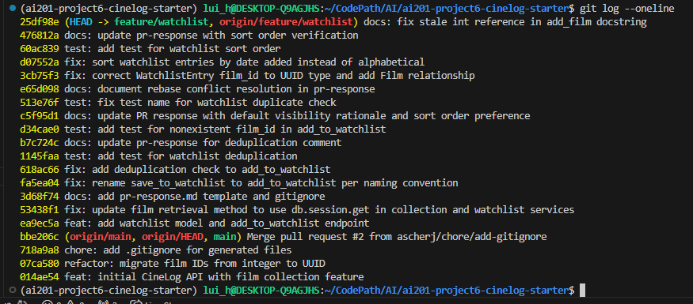

# PR Response Doc — CineLog Watchlist Feature

## AI Usage
<!-- Fill in at the end — how you used AI tools during this project -->

I used Claude throughout this project, mainly for two things: orientation early on, and debugging git during the rebase.

**Codebase orientation:** I asked Claude one specific question to understand the data model: whether each user has a single collection and a single watchlist, or can create multiple, since both `CollectionEntry` and `WatchlistEntry` exist as separate entities. I also wanted to clarify whether the `public` flag applies per-entry (a specific film in the watchlist) or to the whole watchlist itself. This confirmed my understanding that visibility is set per-entry, not per-watchlist, which shaped how I reasoned about Comment 4's default visibility decision.

**Rebase debugging (Comment 6):** I had never done an interactive rebase before this project. When my first rebase attempt silently dropped the `WatchlistEntry` model from `models.py` with no conflict prompt at all, I used Claude to help me systematically trace which specific commit had lost the class, by comparing `git show <commit>:models.py` across the pre-rebase remote branch and the post-rebase local commits. This confirmed the loss happened during an unmarked auto-merge on the very first commit, since it predated the UUID refactor. Claude walked me through using `git rebase -i` with `edit` on that specific commit to fix it in place, instead of redoing the whole rebase. I made the actual fix myself (writing the `WatchlistEntry` class with UUID-typed fields), but Claude helped me diagnose where the problem was and understand why it happened silently.

**Catching a second bug through testing:** While writing a test for Comment 5 (sort order), I discovered on my own that `WatchlistEntry.film_id` was still typed as `db.Integer`, even though my earlier manual verification (via `flask shell`) had seemed to confirm the UUID migration worked. SQLite had been silently accepting UUID strings into that integer column without erroring. I used Claude to help me diagnose why `entry.film` was raising an `AttributeError` (a missing relationship between `Film` and `WatchlistEntry`) and to confirm the fix by comparing against the working `CollectionEntry` pattern already in the codebase.

**What I did without AI:** I drafted my own reasoning for Comments 4 and 5 (default visibility and sort order) before bringing them to Claude for review.

## Comment 1 — Rename
**What I did:** 

Rename save_to_watchlist() to add_to_watchlist()

**How I verified:** 

using ctrl + f in file and ctrl+ shift + f in folder directory

## Comment 2 — Deduplication
**What I did:** 

Add deduplication logic to add_to_watchlist() in services/watchlist_service.py

**How I verified:** 

Added a test in tests/test_watchlist and ran test_add_to_watchlist_duplicate_raises, confirming a second add for the same user/film pair raises AlreadyInWatchlistError rather than silently succeeding or creating a duplicate row.

## Comment 3 — Missing test

**What I did:** 

Created test_watchlist.py and added test_add_to_watchlist_nonexistent_film_raises() test case

**How I verified:** 

Ran the test file `pytest tests/test_watchlist.py -v`

## Comment 4 — Default visibility

**My position:** 

Watchlist entries will default to `public=True`

**Reasoning:** 

Cinelog is a community film tracking app. I think that it would defeat the purpose of the community aspects of this app if all the entries in the user watchlist default to private. We would assume that, if community users are using this community platform to add to their watchlists, they would more often than not be creating public entries to be viewed by the rest of the community. Having to have them manually mark these entries as public if this did default to private would be a lot of extra work.


**Tradeoff acknowledged:** 

I do acknowledge that some users may want their watchlist entries to be private, and therefore they would need to manually change their entries to private when the default is public. There would be a period in which they have created a watchlist entry and the entry could be viewed by others. I, however, think that since there are no notifications when people add to their personal watchlists for others, it's not expected that there is going to be someone monitoring a person's watchlist 24/7. Since this is such a low-stakes sector, this privacy concern can be outweighed by the convenience and usability for the users to have their entries be defaulted to public. 

## Comment 5 — Sort order


**My position:** 

Getting watchlists should be sorted in date added order rather than alphabetical. 


**Reasoning:** 

My reasoning is that when people add something to their watchlist, it may be that they have heard a recommendation about it recently and they don't want to forget it. By having watchlists be sorted in alphabetical order, you may lose the context of someone else's entry that is being added.

As a personal anecdote, when I add books that I want to read on my read list, I kind of do it haphazardly, like when it interests me. I sometimes don't really care too much about a book that I've added two months ago versus a book that I've added a week ago. If I wanted to go and look for the name of the book that I wanted to read but I couldn't remember what it was, I would assume that the most recently added book is the book I added last week and not the one I added two months ago.


**Engagement with reviewer's point:** 

The reviewer's argument that most users want to see what they added recently matches my own experience with using similar watchlist-type features on other apps. Alphabetical order optimizes for looking something up by name, but that's not the primary use case for a watchlist. People are more likely to be scanning for what they did or what they added recently, like last week for example, than searching by title.

Since the reviewer explicitly left room for pushback if I saw it differently, I want to note that I considered a third option: sorting by priority or a user-set order. I rejected it, as it would have been unnecessarily complex for a feature that doesn't have a priority concept. Date added is the simplest implementation that directly satisfies the actual need the reviewer identified, so I'm implementing it as requested. 

## Comment 6 — Rebase


**What conflicted:**  

When I first rebased onto main, the only conflict git flagged was in `.gitignore`. After resolving it, I assumed `--continue` would either stop at the next conflict or finish cleanly, instead, later commits applied without any conflict prompt at all. I ran my tests and discovered that the `WatchlistEntry` model had been silently dropped from `models.py` during the first commit's replay, with no conflict marker shown. Because that commit predates the UUID refactor, git's auto-merge resolved the whole file in one pass and picked main's side without flagging it as a conflict.


**How I resolved it:** 

I hadn't done an interactive rebase before, so I used Claude to help me trace which specific commit lost the class, since I was worried it might have overwritten other work too. I used `git rebase -i origin/main`, changed `pick` to `edit` on that specific commit in the interactive editor, which stopped the rebase right after that commit applied. I re-added the missing `WatchlistEntry` class with UUID-typed fields, following the same pattern as `CollectionEntry`, then ran `git commit --amend` and `git rebase --continue`.


**How I verified no conflict remains:**

I verified that none of the conflicts remained by:
- Running the full test suite and confirmed all tests passed
- Manually creating a `Film` via `flask shell` and confirmed `.id` returned a UUID string rather than an integer, end to end

This first verification pass wasn't actually complete, though. While writing a later test for watchlist sort order (Comment 5), I discovered `WatchlistEntry.film_id` was still typed as `db.Integer` in the schema. SQLite had been silently accepting UUID strings into that column without erroring, so my earlier tests passed by luck rather than by correctness. I fixed the column type to `db.String(36)` to match `Film.id`, added the missing `Film` ↔ `WatchlistEntry` relationship (needed for `entry.film` to work in `get_watchlist()`), and added a proper unique constraint on `(user_id, film_id)` at the database level, matching `CollectionEntry`'s pattern. This was a useful lesson: a manual spot-check can confirm one column works correctly without catching that a related column's type is still wrong, especially with SQLite's loose type enforcement. A dedicated test for a different feature (sort order) was what actually surfaced it.

**Commit history (git log --oneline):**



## PR Description
<!-- Written at the end — feature overview, design decisions, manual testing steps -->

### What this feature does

Adds watchlist functionality to CineLog, letting users save films they intend to watch, separate from their existing collection (films already watched). This includes:

- A `WatchlistEntry` model (mirroring the `CollectionEntry` pattern: UUID-typed `id`, `user_id`, and `film_id`, a unique constraint on `(user_id, film_id)`, and a `public` flag)
- `add_to_watchlist(user_id, film_id)` with deduplication, raising `AlreadyInWatchlistError` for duplicates and `FilmNotFoundError` for nonexistent films
- `get_watchlist(user_id)`, returning entries sorted by date added (newest first)
- Full test coverage: nonexistent film, duplicate entry, and sort order
- Rebased onto main's UUID refactor, with the watchlist code and schema updated to use UUID film IDs throughout

### Design decisions

**Default visibility (`public=True`):** Watchlist entries default to public. CineLog is a community film-tracking app, so defaulting to private would work against that purpose. Most users adding to a watchlist expect it to be visible to others, and a manual toggle for every entry adds friction for the common case. The tradeoff is that privacy-conscious users need to opt out manually, and there's a window where an entry is visible before that happens. Since there's no notification system alerting others when an entry is added, that exposure window is low-stakes in practice.

**Sort order (date-added, not alphabetical):** Watchlist entries are sorted by date added, newest first, per the reviewer's original point that alphabetical order strips away recency. Watchlists tend to get built haphazardly, based on when something caught a user's interest, rather than by title, so date-added better matches how users actually want to scan the list.

### How to manually test

1. Start the app: `python app.py`
2. Add a film to a user's watchlist (replace with real UUIDs from your seeded data):
   ```bash
   curl -X POST http://127.0.0.1:5000/watchlist/<user_id>/add \
     -H "Content-Type: application/json" \
     -d '{"film_id": "<film_uuid>"}' | jq
   ```
3. Confirm a duplicate add is rejected:
   ```bash
   curl -X POST http://127.0.0.1:5000/watchlist/<user_id>/add \
     -H "Content-Type: application/json" \
     -d '{"film_id": "<same_film_uuid>"}' | jq
   # should return an error, not create a second entry
   ```
4. Add a second film with a slight delay, then fetch the watchlist and confirm the most recently added film appears first:
   ```bash
   curl http://127.0.0.1:5000/watchlist/<user_id> | jq
   ```
5. Run the full test suite:
   ```bash
   pytest tests/ -v
   ```
